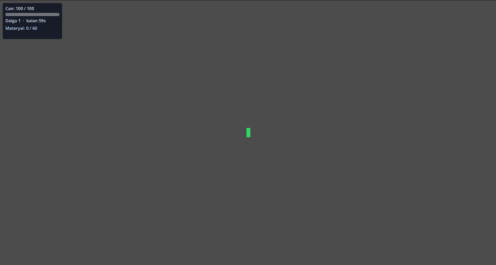
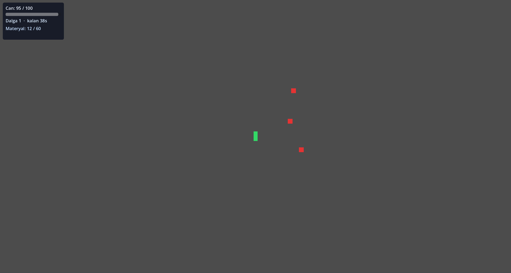
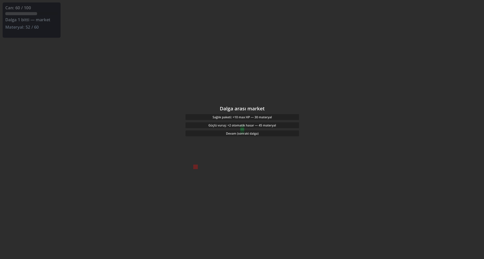

# Project A

**Project A** is a **2D roguelite / survivor-like** in development—**Brotato-style** pacing, short runs, and shop choices between waves.

This repository is the **public showcase**: design intent, process artifacts, screenshots, and **optional Windows playtest builds** via [Releases](https://github.com/umut-yasin-yilmaz/project-a-showcase/releases). **Full source and commercial assets stay in a private development repository.**

---

## At a glance

| | |
|:---|:---|
| **Status** | **MVP shipped** — private dev repo milestones `MVP-01` → `MVP-22`; Git tag **`mvp-0.1`** |
| **Engine** | Godot **4.6.1** |
| **Language** | Typed **GDScript** (production) |
| **Platform target** | PC (**Steam-first**; store page not linked here until that phase is real) |
| **Author** | Solo developer — stack, AI-assisted workflow, and broader context: **[profile README](https://github.com/umut-yasin-yilmaz/umut-yasin-yilmaz)** (this repo stays project-focused). |

---

## Screenshots (MVP build)

| | | |
| :---: | :---: | :---: |
|  |  |  |

---

## Core loop

- Fight enemies in timed waves
- Collect materials from defeated enemies
- Buy upgrades between waves
- Survive the full run (MVP: **5 waves** — see [`docs/blueprint.md`](docs/blueprint.md))

---

## Downloads & releases

- **Playtest (Windows):** check [**Releases**](https://github.com/umut-yasin-yilmaz/project-a-showcase/releases) for the latest zip. Extract and run **`ProjectA.exe`** with all files in the same folder.
- **Non-commercial** playtest drops unless a release explicitly states otherwise. Not a finished commercial product.
- **No game source on `main`.** Zips are **not** committed to git—only attached to Releases.

Maintainer workflow (export → zip → Release): [`docs/godot_export_and_release.md`](docs/godot_export_and_release.md) · Release notes template: [`docs/release_playtest_template.md`](docs/release_playtest_template.md)

**Feedback:** [Issues](https://github.com/umut-yasin-yilmaz/project-a-showcase/issues) welcome with build tag and repro steps.

---

## Documentation

| Document | What it is |
|----------|------------|
| [`docs/blueprint.md`](docs/blueprint.md) | Pitch, session target, core loop, scope / non-goals |
| [`docs/qa_checklist.md`](docs/qa_checklist.md) | MVP + Demo QA gates (Turkish checklist, aligned with shipped MVP) |
| [`docs/risk_register.md`](docs/risk_register.md) | Production risks and mitigations |
| [`docs/credits_and_licenses.md`](docs/credits_and_licenses.md) | Godot MIT, credits, rights |
| [`docs/godot_export_and_release.md`](docs/godot_export_and_release.md) | Godot → zip → GitHub Release |
| [`docs/release_playtest_template.md`](docs/release_playtest_template.md) | Copy-paste Release description |

**Suggested reading order:** blueprint → QA checklist → risk register.

---

## Repository boundaries

**Included here (safe / curated)**

- Vision, high-level gameplay goals, MVP milestone context
- Process artifacts that do not expose production internals
- Portfolio-ready screenshots

**Stays in the private dev repository only**

- Full gameplay source and architecture internals
- Commercial art, audio, and content pipeline
- Implementation-level balance tables beyond what this README and blueprint summarize
- Secrets, credentials, or release-sensitive configuration

---

## License & security

- **Showcase repo:** see [`LICENSE`](LICENSE) and [`docs/credits_and_licenses.md`](docs/credits_and_licenses.md).
- **Vulnerability reporting:** [`SECURITY.md`](SECURITY.md).
- **Contributions:** [`CONTRIBUTING.md`](CONTRIBUTING.md).

---

## Türkçe

**Project A**, **Brotato esintili** bir **2D roguelite** / **hayatta kalma (survivor) tarzı** yapımdır; kısa koşular ve dalgalar arası dükkân seçimleri odakta.

Bu depo **herkese açık vitrin** katmanıdır: tasarım niyeti, süreç dokümanları, ekran görüntüleri ve isteğe bağlı **Windows playtest** paketleri [**Releases**](https://github.com/umut-yasin-yilmaz/project-a-showcase/releases) üzerinden. **Tam kaynak ve ticari assetler özel (private) geliştirme deposunda kalır.**

**Geliştirici ve süreç özeti** (yığın, yapay zekâ destekli çalışma, genel vitrin): **[GitHub profil README](https://github.com/umut-yasin-yilmaz/umut-yasin-yilmaz)** — aynı metinleri burada tekrarlamıyorum; aşağıdaki tablolar yalnızca **Project A** vitrinine ait.

---

## Project A (güncel)

| | |
|---|---|
| **Özet** | **2D roguelite** tarzı: süreli dalgalar, materyaller, dalgalar arası dükkân, koşuyu tamamlama |
| **Motor** | Godot **4.6.1**, **typed GDScript** |
| **Durum** | **MVP yayında** (özel üretim deposu, **`mvp-0.1`**). Özel repoda `MVP-01` → `MVP-22` tamamlandı |
| **Sırada** | Demo odaklı cilâ ve yayın planı; **henüz erken mağaza anlatısı yok** |

---

## Ekran görüntüleri (MVP)

| | | |
| :---: | :---: | :---: |
|  |  |  |

---

## Çekirdek döngü

- Zamanlı dalgalarda savaş
- Materyal toplama
- Dalgalar arası yükseltme satın alma
- Koşuyu tamamlama (MVP: **5 dalga** — ayrıntı [`docs/blueprint.md`](docs/blueprint.md))

---

## İndirmeler ve sürümler

- **Windows playtest:** [**Releases**](https://github.com/umut-yasin-yilmaz/project-a-showcase/releases) sayfasından zip; açıp **`ProjectA.exe`** çalıştırın, dosyaları ayırmayın.
- Varsayılan olarak **ticari olmayan** playtest; nihai ürün değildir.
- **`main` dalında oyun kaynağı yok.** Zip’ler repoya commit edilmez.

Bakım akışı: [`docs/godot_export_and_release.md`](docs/godot_export_and_release.md) · Release metni şablonu: [`docs/release_playtest_template.md`](docs/release_playtest_template.md)

**Geri bildirim:** [Issues](https://github.com/umut-yasin-yilmaz/project-a-showcase/issues)

---

## Dokümanlar

| Doküman | Ne işe yarar |
|---------|----------------|
| [`docs/blueprint.md`](docs/blueprint.md) | Pitch, oturum hedefi, çekirdek döngü, kapsam / non-goals |
| [`docs/qa_checklist.md`](docs/qa_checklist.md) | MVP + Demo test kapıları (**kalite kontrol listesi / QA**) |
| [`docs/risk_register.md`](docs/risk_register.md) | **Risk kaydı** — üretim riskleri ve önlemler |
| [`docs/credits_and_licenses.md`](docs/credits_and_licenses.md) | Godot MIT, credits, haklar |
| [`docs/godot_export_and_release.md`](docs/godot_export_and_release.md) | Godot → zip → GitHub Release |
| [`docs/release_playtest_template.md`](docs/release_playtest_template.md) | Release açıklaması şablonu |

**Önerilen okuma sırası:** blueprint → QA checklist → risk register.

---

## Sınır: bu repo vs geliştirme reposu

**Bu vitrin reposunda bilerek olanlar:** vizyon, üst seviye oyun hedefleri, **MVP yayında** bağlamı, üretim içine sızmayan süreç dokümanları, portfolio için uygun ekran görüntüleri.

**Yalnızca özel (private) geliştirme reposunda kalanlar:** tam oyun kaynağı ve mimari iç detaylar, ticari sanat/ses ve içerik hattı, uygulama düzeyinde denge tabloları (bu README ve blueprint’in özetlediğinin ötesinde), gizli bilgiler, dağıtıma duyarlı yapılandırma ve bakımcı dağıtım runbook’u (`docs/distribution_plan.md`).

---

## Lisans ve güvenlik

- **Vitrin deposu:** [`LICENSE`](LICENSE) ve [`docs/credits_and_licenses.md`](docs/credits_and_licenses.md).
- **Güvenlik bildirimi:** [`SECURITY.md`](SECURITY.md).
- **Katkı:** [`CONTRIBUTING.md`](CONTRIBUTING.md).
